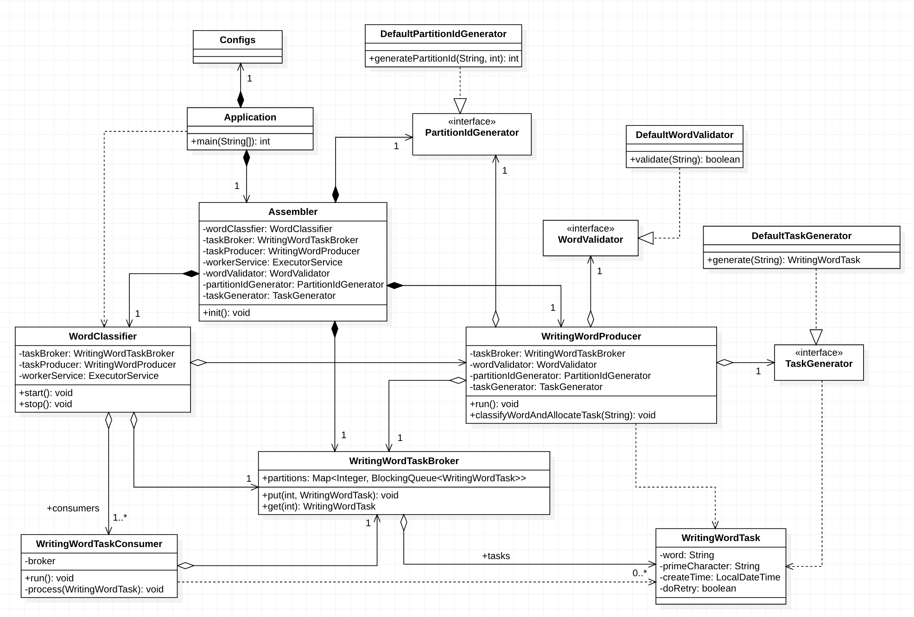

# Producer & Consumer 패턴 학습

본 프로젝트는 이하와 같이 Producer-Consumer 문제에 해당하는 특정 요구 사항을 Java 언어를 사용하여 개발한 프로젝트이다.

- Wikipedia에서 발췌

```
생산자-소비자 문제(producer-consumer problem)[1][2]는 여러 개의 프로세스를 어떻게 동기화할 것인가에 관한 고전적인 문제이다.
한정 버퍼 문제(bounded-buffer problem)라고도 한다.

유한한 개수의 물건(데이터)을 임시로 보관하는 보관함(버퍼)에 여러 명의 생산자들과 소비자들이 접근한다.
생산자는 물건이 하나 만들어지면 그 공간에 저장한다. 이때 저장할 공간이 없는 문제가 발생할 수 있다.
소비자는 물건이 필요할 때 보관함에서 물건을 하나 가져온다. 이 때는 소비할 물건이 없는 문제가 발생할 수 있다.

이 문제를 해결하는 것을 생산자-소비자 협동이라 하며, 버퍼가 동기화되어 정상적으로 동작하는 상태를 뜻한다.
문제를 해결하기 위해 세마포어를 활용할 수 있다.
```

## 가. 개발 요구사항 정의

### 개발 요구사항

1. Maven 기반으로 프로젝트를 구성한다.

2. Producer & Consumer 디자인 패턴을 응용해 아래의 요구사항을 구현한다.
    - 프로그램 설계 요구사항
        - 객체지향 설계 5원칙(SOLID)에 의거하여 프로그램을 설계한다.

    - Producer 요구사항
        - word.txt 파일에서 각 라인의 단어를 읽어온다.

        - 각 라인의 주어진 단어가 유효한지 정규표현식을 활용해 유효성을 검사한다.
            - 유효한 단어는 알파벳으로 시작되며 대소문자는 구분하지 않는다.
            - 알파벳 외 문자로 시작하는 단어는 유효하지 않은 것으로 판단한다.
            - 예 : ab!23(유효), A12bd(유효), 123abc(유효하지 않음)

        - 유효하지 않은 단어들은 Consumer로의 전달을 생략한다.

        - 유효한 단어들은 N개의 파티션으로 통해 Consumer에 나누어 전달한다.
            - 파티션 수(N)는 프로그램의 실행 argument로 입력 받는다. (1 < N < 27)
            - 동일한 단어는 항상 동일한 파티션에 포함되어야 한다.

        - 동일한 유효 단어가 2개 이상 word.txt에 포함될 수 있으며, 2개 모두 전달한다. (중복 허용)

    - Consumer 요구사항

        - 파티션에서 순차적으로 단어를 1개씩 가져온다.
        - 단어의 첫 알파벳에 해당하는 파일이 존재하지 않으면 새로 만들고, 존재한다면 기존 파일 끝에 주어진 단어를 추가한다. (대소문자 구분없음)
            - 예: 단어가 apple 또는 Apple 이라면 a.txt 파일에 해당 단어를 추가한다.

    - 프로그램 실행-종료 요구사항

        - 프로그램의 실행 argument로 3개의 값을 입력받는다.
            - 처리해야 할 단어들이 기재된 원본 파일 경로 (예: words.txt 파일경로)
            - 결과 파일들을 저장 할 디렉토리 경로
            - 병렬 처리를 위한 파티션 수 N (1 < N < 27)

        - 프로그램 종료시 사용된 리소스를 올바르게 정리

### 개발 제약 조건

|항목|설명|
|:---:|---|
|프로그래밍 언어|Java(JDK8 이상 사용)|
|프레임워크|JDK 만을 사용하고 다른 서드파티 프레임워크(Spring, Google Guice 등) 사용을 금지한다.<br/>단, 유닛 테스팅 용 테스트 프레임워크(JUnit 등)와 로깅을 위한 로깅 프레임워크 및 퍼사드(Log4j, Slf4j)는 허용한다.|
|라이브러리|JDK 만을 사용하고 다른 오픈소스 라이브러리(Google Guava, Apache commons, Lombok 등) 사용을 금지한다.|


## 나. 요구사항 구현

### 설계 고려사항

1. Robert C.Martin이 주장한 어플리케이션 영역, 메인 영역을 활용하여 전체 프로그램을 설계한다.
    - 모든 의존은 메인 영역에서 어플리케이션 영역으로 향하도록 설계
    - 어플리케이션 영역: 고수준 정책 및 저수준 구현을 포함한 영역
    - 메인 영역: 어플리케이션이 동작하도록 각 객체들을 연결해주는 영역

2. 메인 영역에서 객체의 라이프사이클을 관리하되, 객체들 간의 의존관계 형성 방법은 DI를 사용한다.
    - 생성자를 통해 의존 객체를 주입하는 생성자 방식을 사용
    - Setter 메소드를 통해 의존 객체를 주입하는 설정 메소드 방식은 지양 (NullPointerException 방지를 위하여)

3. Producer & Consumer 패턴 구현은 이하와 같이 설계한다.
    - java.util.concurrent.BlockingQueue를 활용하여 Producer & Consumer 패턴을 구현
    - java.util.concurrent.ExecutorService를 활용하여 Producer와 Consumer에 할당된 Thread를 관리
    - word.txt 파일을 읽어서 업무 객체를 생성하는 Producer는 요구사항에 따라 1개로 구현

4. N개의 파티션 구현은 이하와 같이 설계한다.
    - N개의 파티션 요구사항은 3번의 BlockingQueue를 파티션과 동일한 의미로 활용
    - 파티션은 int 타입의 id로 구분 (id는 0부터 시작)
    - N개의 파티션 관리 및 파티션에 업무 객체를 넣고 빼는 Broker를 구현
        - Broker는 Map<Integer, BlockingQueue<Task>> 명세를 갖는 파티션 저장소를 소유
    - 처리율을 높이기 위하여 업무 객체들의 병렬 처리를 위하여 하나의 Consumer가 하나의 파티션에 대응하도록 설계 (1:1 대응)

5. Producer의 비즈니스 로직 중 변경될 가능성이 있는 부분은 Strategy 패턴을 적용한다.
    - Producer가 단어가 유효한지 검사하는 로직
    - Producer가 업무를 파티션에 할당하기 위하여 파티션을 선택하는 로직
    - Producer가 업무 객체의 형질을 결정(업무 수행 시 오류가 발생했을 떄 Retry를 허용할지 말지 등)하는 로직

6. Task를 파티션에 분배하기 위하여 다음을 구현한다.
    - 유효 단어의 CRC32 해시값(int 타입)과 파티션 전체 개수의 modulo 연산을 수행하여 저장할 파티션 id를 얻어 파티션에 저장
    - 유효 단어의 CRC32 해시값을 이용하기 때문에 요구사항 중 '동일한 단어는 항상 동일한 파티션에 포함되어야 한다.' 항목을 만족

7. File IO 구현은 IO 성능 향상을 도모하기 위해 java.nio.file.Files를 사용하여 구현한다.

### 주요 클래스 설명

|클래스 이름|설명|영역|
|:---:|---|:---|
|Application|메인 클래스|메인 영역|
|Configs|main 메소드를 통해 전달받는 argument 값들을 저장|메인 영역|
|Assembler|어플리케이션 영역에 속하는 객체들의 의존 관계를 조립|메인 영역|
|WordClassifier|Producer, Broker, Consumer를 관리하는 클래스|어플리케이션 영역|
|WritingWordTaskProducer|Producer 역할 클래스<br/>word.txt 파일의 단어를 읽어 단어 유효성 검증<br/>유효한 단어에 대한 업무 객체를 생성<br/>생성된 업무 객체를 Broker를 통해 Consumer에게 Task를 전달|어플리케이션 영역|
|WritingWordTaskConsumer|Consumer 역할 클래스<br/>할당된 파티션을 읽어 전달받은 업무 객체가 가지고 있는 유효한 단어를 꺼내 단어에 알맞은 파일에 기록|어플리케이션 영역|
|WritingWordTaskBroker|Partition 저장소 역할 클래스<br/>Configs 객체를 통해 전달받은 파티션 설정 값만큼 파티션(BlockingQueue)을 생성|어플케이션 영역|
|WritingWordTask|Consumer가 수행할 업무 정보 클래스|어플리케이션 영역|
|WordValidator|주어진 단어가 유효한 단어인지 확인하는 기능을 명세한 인터페이스 클래스|어플리케이션 영역|
|PartitionIdGenerator|유효한 단어를 분석하여 올바른 파티션 id를 도출하는 기능을 명세한 인터페이스 클래스|어플리케이션 영역|
|TaskGenerator|업무 객체의 형질을 결정하는 기능을 명세한 인터페이스 클래스|어플리케이션 영역|

### 클래스 다이어그램



## 다. 실행 방법

- Maven package 명령어 실행하여 jar 빌드 수행

```
    ./mvn clean package -P default
```

- target 디렉토리로 이동하여 jar 실행

```
    cd target
    java -jar WordClassfier-${project.version}.jar 단어파일위치 결과파일저장디렉토리위치 파티션개수(숫자)
```


## 라. 추가적으로 개선할 사항

이하와 같은 문제가 존재하지만, 개발을 진행한 시간이 짧아 모두 구현할 수 없어서 추후 개선을 위하여 기록을 남김


1. 에러가 발생했을 경우 Retry 수행이 추가 요구사항으로 도출된다면 어떻게 개선할 것인지?

    * 수행 도중 오류가 발생한 업무는 로그를 남기고 무시하는 것으로 처리되고 있음.
        * 현재는 Producer, Consumer의 업무 수행 도중 파일 입출력 시 IOException, BlockingQueue에 업무 할당 시 InterruptedException 오류 발생가능.

2. 업무 객체가 처리되는 속도보다 쌓이는 속도가 빠를 경우의 처리는 어떻게 개선할 것인지?

    * BlockingQueue의 구현체로 LinkedBlockingQueue를 사용하고 있으나, capacity를 Integer.MAX_VALUE로 사용 중
        * 파일 입출력이 Consumer에서 진행되므로 처리가 당연히 느릴 수 밖에 없음.
        * 원본 단어 파일이 엄청 큰 경우 Queue에 과도하게 업무 객체가 쌓일 가능성 높음. (OutOfMemory 문제)
